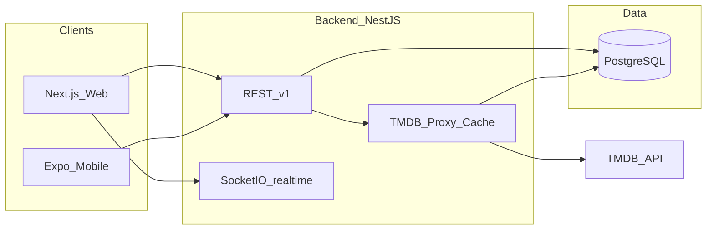
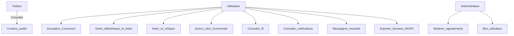
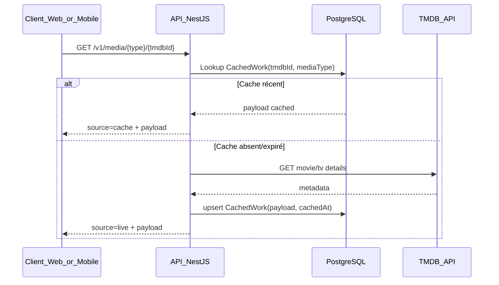
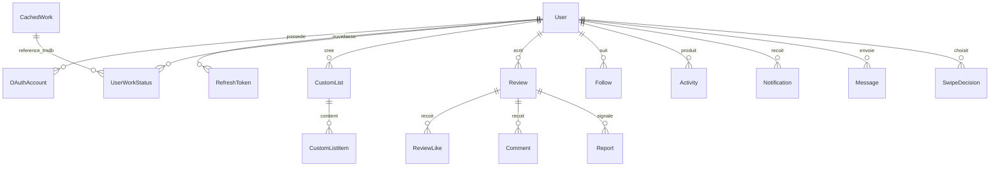

# Documentation Technique — Kino (SUPCONTENT)

## 1) Pré-requis

- Node.js 20+ (22 conseillé)
- npm 10+
- PostgreSQL 16
- Clé TMDB v3 (`TMDB_API_KEY`) ou token TMDB v4 (`TMDB_READ_ACCESS_TOKEN`)

## 2) Installation locale

```bash
git clone https://github.com/CelianSUPINFO/3PROJ_Kino.git
cd 3PROJ_Kino
cp .env.example apps/api/.env
```

Configurer au minimum dans `apps/api/.env`:

- `DATABASE_URL`
- `JWT_ACCESS_SECRET`
- `TMDB_API_KEY` ou `TMDB_READ_ACCESS_TOKEN`

Puis:

```bash
cd apps/api
npx prisma migrate deploy
npx prisma generate
npm run start:dev
```

Web:

```bash
cd apps/web
npm run dev
```

Mobile:

```bash
cd apps/mobile
npx expo start
```

## 3) Justification des choix

- **Backend**: NestJS (modularité, guards, DTO validation, WebSocket natif).
- **Base locale**: PostgreSQL + Prisma (relations sociales fortes, migrations versionnées).
- **Web**: Next.js (rendu performant, structure claire par routes).
- **Mobile**: Expo React Native (même langage TypeScript, itération rapide).
- **API tierce**: TMDB, utilisée uniquement côté serveur via module `media`.

## 4) Architecture globale



## 5) Cas d’usage UML (vue synthèse)



## 6) Séquence — consultation d’une fiche TMDB avec cache



## 7) Schéma de données (résumé)

Tables principales:

- `User`, `OAuthAccount`, `RefreshToken`
- `CachedWork` (cache TMDB intelligent)
- `UserWorkStatus`, `CustomList`, `CustomListItem`
- `Review`, `ReviewLike`, `Comment`, `Report`
- `Follow`, `Activity`, `Notification`
- `Message`
- `SwipeDecision` (choix Smash/Pass de l’écran Ce soir)

Le schéma source est maintenu dans `apps/api/prisma/schema.prisma`.

### ERD simplifié



## 8) Endpoints principaux

- Auth: `/v1/auth/*`
- Média TMDB: `/v1/media/*`
- Recherche unifiée: `/v1/search`
- Bibliothèque/Listes: `/v1/library/*`
- Critiques/likes/commentaires/signalements: `/v1/reviews/*`
- Fil: `/v1/feed`
- Notifications: `/v1/notifications/*`
- Messagerie: `/v1/messages/*` (follow mutuel, notifications, messages lus/non lus)
- Admin: `/v1/admin/*`
- Export RGPD: `/v1/users/export` + `/v1/users/export.csv`
- Suppression compte: `DELETE /v1/users/me`
- Accueil: `/v1/home`
- Recommandations: `/v1/reco/tonight`, `/v1/reco/swipe`
- Engagement: `/v1/engagement/summary`

## 8.1) Traçabilité cahier des charges

| Exigence                                      | API                             | Web                      | Mobile                    |
| --------------------------------------------- | ------------------------------- | ------------------------ | ------------------------- |
| Inscription, connexion, OAuth                 | `auth`                          | login/register/oauth     | login/register            |
| Recherche TMDB et fiche média                 | `media`, `search`, `CachedWork` | search, title            | Search, Title             |
| Bibliothèque et listes                        | `library`                       | library, list            | Library, actions fiche    |
| Critiques, likes, commentaires, signalements  | `reviews`                       | title                    | avis sur fiche            |
| Follow, fil social                            | `users`, `feed`                 | profil, feed             | Feed                      |
| Notifications                                 | `notifications`, Socket.IO      | notifications temps réel | notifications par polling |
| Messagerie mutuelle                           | `messages`                      | messages                 | Messages                  |
| Modération admin                              | `admin`                         | admin                    | périmètre web             |
| Paramètres, export RGPD et suppression compte | `users`                         | settings                 | Settings                  |

## 9) Sécurité

- Hash mot de passe: `bcryptjs`
- JWT access + refresh token hashé
- Secrets via `.env` uniquement
- Guards NestJS (`JwtAuthGuard`, `AdminGuard`)
- Aucun appel TMDB depuis clients
- CORS limité via `CORS_ORIGINS`
- Export RGPD JSON/CSV et suppression de compte utilisateur
- Signalements uniques par utilisateur et critique

## 10) Déploiement local docker (option)

```bash
docker compose up --build
```

Services:

- `db` (PostgreSQL)
- `api`
- `web`
- `redis` (service optionnel prévu pour cache distribué/rate-limit si l’application est déployée à plus grande échelle)
